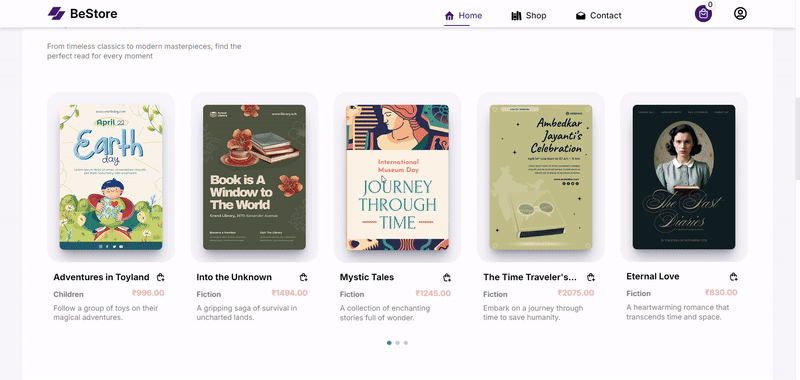

Bestore with admin access
MERN Stack Bestore Book Store Website MongoDB, Express, React, Node.js and Tailwind CSS with Stripe & COD payment complete CRUD App with ADMIN panel.

Description

📚 Book Store with Admin App – Overview
A Book Store with Admin App allows customers to browse, search, and purchase books, while the admin panel manages inventory, orders, and users.

🚀 Features Breakdown
1️⃣ Customer App (Frontend)
🔹 Book Browsing & Search – Users can explore books by category, author, or title.
🔹 Book Details Page – Displays description, author, price, and reviews.
🔹 Add to Cart & Checkout – Users can purchase books using online payment methods.
🔹 User Authentication – Signup, login, and profile management.
🔹 Order Tracking – Users can check order status and history.
🔹 Wishlist & Reviews – Save books for later and leave reviews.

2️⃣ Admin Panel (Backend)
🔹 Dashboard – Overview of orders, and users.
🔹 Book Management – Add, update, or delete books 
🔹 Order Management – View and process customer orders.
🔹 User Management – Manage customer accounts and access levels.

🛠️ Tech Stack
Frontend: React.js (for UI), TailwindCSS ,Stripe
Backend: Node.js with Express.js and MongoDB

Libraries Used:
Library Name	Description
React Js	-Frontend Framework
React Router	-Routing library
Axios        -	HTTP client for making API requests
headlessui/react	- Accessible React components
cloudinary       - easily upload images
mongoDB         - database store and retrieve data
React Icons  	-    Icon library for React
stripe-react  -      Stripe paymnet gateway
Tailwind CSS  -	Utility-first CSS framework

To run this project,you need install all dependencies and run the following commands in your terminal

Installation
To run the Project locally, follow these steps:

Clone the Repository

https://github.com/eswarpb/book-store-with-admin.git

Navigate to the project directory

cd Book-store-with-admin

Install the dependencies using npm

npm install -frontend
npm install -backend
npm install -admin

Configuration
Create a .env file in the root directory and add the following configurations:
for frontend:
VITE_HOST='host run sever port'

for backend:
MONGODB_KEY:"key for database"
STRIPE_KET:"key for stripe payment gateway'
ADMIN_EMAIL:'you can give any email'
ADMIN_PASS:"you can set password also" 
CLDN_NAME='replace with name of your cloudinary account'
CLDN_API_KEY='replace with your cloudinary api'
CLDN_API_SECRET='replace with your cloudinary api'
JWT_SECRET="dummy"

for Admin
VITE_HOST='host run sever port'

Preview

